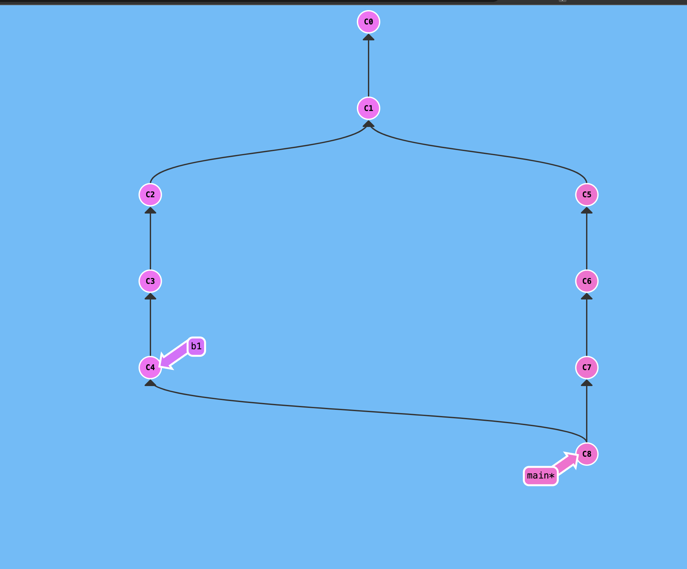

I. Merge và rebase
    1.Merge
    - Git tạo một commit mới để kết hợp thay đổi từ 2 nhánh khác nhau.
    - Commit này có 2 cha là commit của mỗi nhánh.
    Ưu điểm: 
        - Merge dễ hiểu và an toàn hơn khi tích hợp thay đổi từ 2 nhánh khác nhau.
        - Giữ lại lịch sử của cả 2 nhánh.
    Nhược điểm:
        - Commit merge làm lịch sử GIT trở nên phức tạp hơn.
        - Lịch sử của nhánh sẽ bị phân tích thành 2 nhánh riêng biệt trong lịch sử GIT.
    Hình ảnh minh hoạ:
        
    
    2. Rebase
    - Tạo bản sao các commit của nhánh khác và di chuyển vào trên đầu của nhánh hiện tại.
    Ưu điểm:
        - Lịch sử các nhánh được giữ nguyên các commit mới sẽ được sắp xếp một cách hợp lý hơn.
        - Giảm số lượng commit không cần thiết trong lịch sử GIT.
    Nhược điểm:
        - Gây sung đột khi các thay đổi từ 2 nhánh ảnh hưởng lên cùng một vùng code.
    Hình ảnh minh hoạ:
        